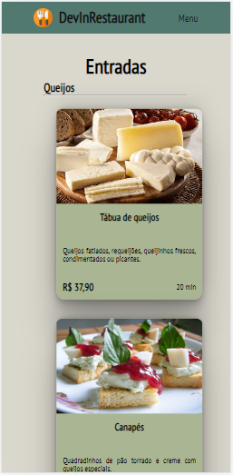
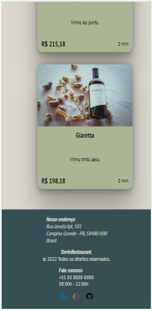
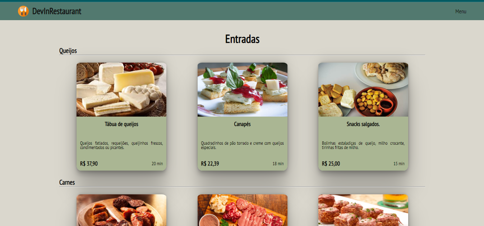
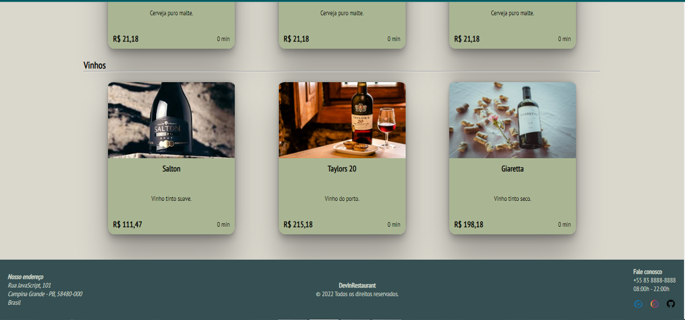

<p align="center">
  

  
  
  <a href="https://github.com/andersonaguia/README/commits/master">
    
  </a>
    
   
   <a href="https://github.com/andersonaguia/README/stargazers">
    
  </a>

  <a href="https://www.instagram.com/anders.aguiar/">
    
  </a>  
 
</p>
<h1 align="center">
    
</h1>

<h4 align="center"> 
	🚧  DevInRestaurant 🚀 Em construção 🚀 🚧
</h4>

<p align="center">
 <a href="#-sobre-o-projeto">Sobre</a> •
 <a href="#-funcionalidades">Funcionalidades</a> •
 <a href="#-layout">Layout</a> • 
 <a href="#-como-executar-o-projeto">Como executar</a> • 
 <a href="#-tecnologias">Tecnologias</a> • 
 <a href="#-autor">Autor</a> • 
 <a href="#user-content--licença">Licença</a>
</p>


## 💻 Sobre o projeto

DevInRestaurant - é um projeto que visa apresentar ao usuário um cardápio de forma dinâmica e prática.


Projeto desenvolvido durante a **NLW - Next Level Week** oferecida pela [Rocketseat](https://blog.rocketseat.com.br/primeira-next-level-week/).
O NLW é uma experiência online com muito conteúdo prático, desafios e hacks onde o conteúdo fica disponível durante uma semana.

---

## ⚙️ Funcionalidades

- [x] Novos produtos podem ser cadastrados no arquivo produtos.json
- [x] O sistema divide os produtos por seções e subseções

---

## 🎨 Layout

### Mobile

<p align="center">
  

  
</p>

### Web

<p align="center" style="display: flex; align-items: flex-start; justify-content: center;">
  

  
</p>

---

## 🚀 Como executar o projeto

Este projeto é composto apenas pelo Frontend(pasta web). É utilizado o arquivo produtos.json para simular os dados dados do back end.

### Pré-requisitos

Antes de começar, você vai precisar ter instalado em sua máquina as seguintes ferramentas:
[Git](https://git-scm.com), [Node.js](https://nodejs.org/en/). 
Além disto é bom ter um editor para trabalhar com o código como [VSCode](https://code.visualstudio.com/)

#### 🧭 Rodando a aplicação web (Frontend)

```bash

# Clone este repositório
$ git clone https://github.com/andersonaguia/DevInRestaurant.git

# Acesse a pasta do projeto no seu terminal/cmd
$ cd semana7

# Instale as dependências
$ npm install

# Execute a aplicação em modo de desenvolvimento
$ npm run dev

# A aplicação será aberta na porta:5174 - acesse  http://127.0.0.1:5174/

```

---

## 🛠 Tecnologias

As seguintes ferramentas foram usadas na construção do projeto:

#### **Website**  ([React](https://reactjs.org/)  +  [Vite](https://vitejs.dev/))

-   **[React](https://reactjs.org/)

> Veja o arquivo  [package.json](https://github.com/andersonaguia/DEVinHouse.git/semana7/package.json)

---

## 🦸 Autor

<a href="https://www.instagram.com/anders.aguiar/">
 
 <br />
 <sub><b>Anderson Aguiar</b></sub></a> <a href="https://www.instagram.com/anders.aguiar/" title="Instagram">🚀</a>
 <br />

[](https://www.linkedin.com/in/andersonlaguiar/) 
[](mailto:andersonlaguiar@gmail.com)

---

## 📝 Licença

Este projeto esta sobe a licença [MIT](./LICENSE).

Feito com ❤️ por Anderson Aguiar 👋🏽 [Entre em contato!](https://www.linkedin.com/in/andersonlaguiar/)

---

##  Versões do README

[Português 🇧🇷](./README.md)
